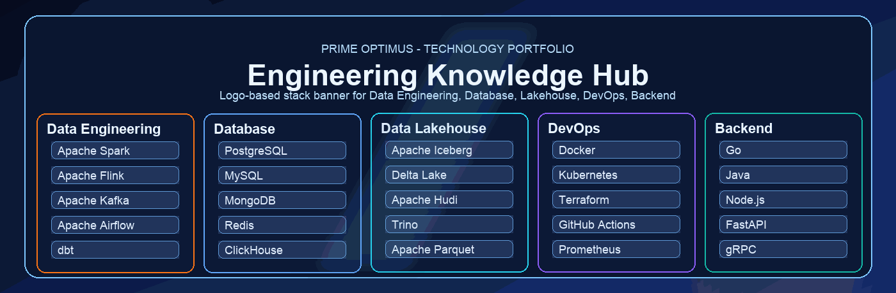

  <picture>
    <source srcset="./assets/banner-pro.gif" type="image/gif">
    
  </picture>

# CyberCore Books

Kho lưu trữ học tập cá nhân, nơi mình tổng hợp sách kỹ thuật và triển khai lại các bài thực hành theo hướng có hệ thống, có thể tái sử dụng, và có thể mở rộng thành mini-project.

## Định hướng repository

- Xây dựng nền tảng kiến thức kỹ thuật theo chiều sâu, bám sát nội dung từ sách.
- Chuyển lý thuyết thành thực hành thông qua code mẫu, ghi chú, và bài tập.
- Chuẩn hóa cách tổ chức tài liệu để thuận tiện tra cứu và ôn tập dài hạn.

## Phạm vi nội dung

- Database và Data Engineering.
- Go, Rust, Java, JavaScript, TypeScript.
- Backend, Microservices, System Design.
- DevOps, Redis, AI và các chủ đề liên quan.

## Tech Stack

### Data Engineering

### Database

### Data Lakehouse

### DevOps

### Backend

## Cấu trúc làm việc

- Mỗi thư mục đại diện cho một mảng kiến thức hoặc một cuốn sách cụ thể.
- Bên trong có thể bao gồm ghi chú, code thử nghiệm, bài tập, hoặc project thực hành.
- Các nội dung được cập nhật liên tục trong quá trình học và thực nghiệm.

## Đóng góp

Nếu bạn có tài liệu hoặc đầu sách phù hợp, bạn có thể mở `Pull Request` để chia sẻ.
Mình luôn trân trọng các đề xuất giúp repo ngày càng chất lượng hơn.

## Tác giả

**Prime Optimus**
